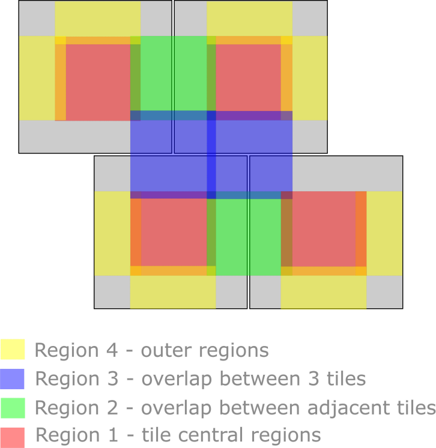

# WALLABY events

Collection of publisher/subscriber code and long-running services on the AusSRC event system to automate data post-processing for the WALLABY survey.

## Postprocessing

Identifies when footprints have been observed based on the distance between sky coordinates in RA/Dec. Submits a post-processing pipeline for the two footprints to run on the overlapping region.

## Subscribers

### Job State

Listens for Slurm state change events and updates postprocessing database entries.

### CASDA

Listens to published messages on the CASDA queue for WALLABY observations. Publishes message on workflow queue to run the footprint quality check pipeline.
